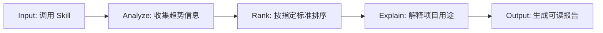

# Proposal: TrendFollower

## Turning GitHub Trend Discovery into a Reusable Codex Skill

## 1. 为什么我选择这个选题

这段时间，我一直在观察 AI 领域里的新项目是如何被发现、被讨论以及被传播的。

几乎每一周，GitHub 上都会出现新的开源 AI 工具、coding agent、workflow framework 或 developer utility。有些项目短短几天就涨了几千个 stars，也很快被搬运到 X、YouTube、小红书、博客或 newsletter 上，变成“本周最值得关注的 AI 工具”“最近爆火的开源项目”这类内容。

一开始我很感兴趣。AI 领域更新太快，每一个新项目背后都可能代表一种新的技术趋势：新的 agent 工作流、新的编程方式、新的自动化工具，或者新的开源实验。它像一个窗口，让我看到开发者社区现在在关注什么。

但看得越多，我越发现一个问题：信息很多，却很零散。很多内容看起来都在介绍“最新 AI 工具”，但点进去之后，常常只是重复项目名称和功能。作为用户，我可能花五分钟、十分钟看完一个视频，再点进 GitHub repo，读 README、看 stars、看 demo，最后才发现这个项目并不是我真正需要的。

所以问题不是“没有人分享 GitHub 项目”。相反，问题是信息太多、太碎，也太依赖人工筛选。用户真正需要的，不只是更多推荐，而是一个更快、更清楚、更可重复的方式，帮助自己判断：

> 这周哪些 GitHub 项目真的涨得快？  
> 它们分别是做什么的？  
> 它们为什么值得关注？  
> 哪些项目才和我真正有关？

这也是我选择做 **TrendFollower** 的原因。我想把“发现 GitHub 热门开源项目”这件事，从零散的信息消费，变成一个可以直接调用的 Codex skill。用户不需要到处刷内容，也不需要从一堆相似视频里慢慢找重点。只要输入一个简单指令，就能看到过去一周增长最快的开源项目，并用简洁语言理解它们到底是做什么的。

对我来说，TrendFollower 不只是一个工具，也是我对 AI 信息爆炸的一种回应：既然这个领域变化这么快，我们也需要一种更快、更结构化的方式去跟上它。

## 2. 我看到的问题

一开始关注 GitHub Trending 的时候，我很自然会被 stars 高、增长快的项目吸引。看到一个项目突然冲上榜单，我也会想点进去看看：它做了什么？为什么这么多人关注？它是不是我也能用上的工具？

但真正用下来，单纯依赖 GitHub Trending 或网络推荐，效率并没有想象中高。

GitHub Trending 更像是一个默认榜单。它可以告诉我哪些项目正在被关注，但不一定能直接告诉我这些项目和我有什么关系。很多时候，我还是要一个个点进去看 README、安装方式、demo 和别人怎么评价，最后再判断值不值得继续研究。

网络推荐也是类似的。很多人了解一个新项目，都是先看到别人的视频、帖子或推荐，然后自己搜索、打开 GitHub、阅读 README，甚至再把项目丢给 AI 分析。这个过程看起来很自然，但实际体验并不总是高效。

有时候，我看完一个五分钟或十分钟的视频，才发现这个项目不是我需要的。  
有时候，我打开一个 repo，读完 README，才发现它的使用场景和我想象的不一样。  
有时候，我让 AI 帮我总结项目，token 烧了一轮之后，才发现这个工具还不如我原本用的方案。

这时浪费的就不只是时间，也包括注意力、判断成本，甚至是昂贵的 token 成本。

所以我看到的核心问题是：

> 用户缺少的不是更多项目推荐，而是一个更快、更清楚、更低成本的方式，去判断哪些 GitHub 项目真的值得关注。

现在的发现路径太分散了。用户通常要先看到推荐，或者自己去 GitHub Trending 搜索；再点进 repo，看 stars、README、demo 和安装说明；如果看不懂，还要丢给 AI 总结；最后才判断这个项目到底是不是自己需要的。

这个流程本身不复杂，但每一步都会消耗时间，也不够可重复、不够针对个人需求。TrendFollower 想先解决这个最基础的问题：让用户快速看到过去一周 GitHub 上增长最快的开源项目，并先得到一个清晰的 overview，再决定要不要进一步研究。

## 3. 我的核心洞察：趋势发现不应该只是一次性内容

在观察这些 AI 工具推荐内容的过程中，我慢慢意识到：追踪 GitHub 和 AI 开源项目的趋势，不是偶尔才会发生的需求，而是一个会反复出现的小需求。

对于关注 AI、开源项目、编程工具或 agent workflow 的人来说，我们可能每周，甚至每隔几天，都会想知道：最近又出现了什么新项目？开发者社区在关注什么？有没有什么工具可以马上用到？有没有什么新的方向值得学习？

也就是说，“发现趋势”本身是一个固定需求。

也正因为这个任务太日常、太细小，它反而很容易被忽略。很多人会默认用刷视频、看帖子、点开 repo、再让 AI 总结的方式来完成它，但其实这些碎片化的步骤每一次都会消耗时间、注意力和 token。单次看起来可能只是几分钟，但如果这是一个每周都会重复发生的需求，累积下来就是很大的成本。

所以我开始意识到，真正值得优化的不是某一次项目推荐，而是这个反复发生的小流程本身。哪怕每次只节省一点时间，也能减少不必要的 token 消耗，让 AI 的执行路径更稳定，也让用户更快进入真正的判断和使用阶段。

这也是我为什么想到把它做成一个 skill。我理解的 skill，不只是一个提示词，也不只是一个单独功能。它更像是在 AI 编程环境里的固定工作流。尤其是在搜索、筛选、排序、总结这类任务中，如果没有清晰流程，AI 可能会漏掉来源、混淆排序标准，或者输出一堆看起来有用但其实不够可靠的信息。

而 skill 的价值就在这里：它把任务拆成相对固定的步骤，让 AI 知道每次应该按照什么逻辑去完成。用户不需要每次都重新解释需求，也不需要让 AI 从零开始猜应该怎么找、怎么排、怎么总结。

所以，对我来说，TrendFollower 的重点不只是“帮我找十个热门项目”。更重要的是，它把一个原本零散、重复、容易浪费时间的趋势发现过程，变成了一个可以反复使用的 AI workflow。

## 4. 我的解决思路：把 GitHub 趋势发现变成一个可调用的 Skill

确定这个选题之后，我没有一开始就直接想代码，而是先验证思考：如果要把“发现 GitHub 趋势项目”做成一个可以反复使用的 workflow，它需要满足什么条件？

因为我平时比较常使用 Codex，也开始了解 skills 在 AI 编程环境中的作用，所以我想到的方向不是再做一个普通榜单总结，而是把这个过程封装成一个 **Codex skill**。这样用户以后不需要每次重新描述需求，也不需要重新让 AI 判断怎么搜索、怎么排序、怎么总结，而是可以直接调用一个固定流程。

在设计方案之前，我也用 GPT 和 Gemini 交叉讨论过这个想法，主要确认三件事：这个需求是否真实存在；这个 workflow 是否可以拆成固定步骤；这个项目是否适合包装成一个开源 skill 和内容选题。

在信息来源上，我选择从两个方向入手：一个是 **GitHub Trending**，另一个是整理 GitHub star growth 和开源项目趋势的网站，例如 RepoFOMO / RepoFollow 这类趋势榜单。GitHub Trending 可以让我看到当前被广泛关注的项目，star growth 类榜单则可以从“增长速度”的角度判断哪些项目正在快速上升。

这个 workflow 可以简化成四个阶段：



这样的设计可以让结果更稳定，也更容易复用。用户不需要知道背后具体用了哪些搜索步骤，也不需要手动比较每一个 repo。TrendFollower 会先完成第一轮筛选，把最重要的信息整理出来。

目前这个项目的目标不是取代用户自己的判断，而是帮助用户更快进入判断阶段。用户可以先通过 TrendFollower 获得一个 overview，再决定哪些项目值得进一步打开、测试或学习。

在安全性和文档边界上，我也希望这个项目保持透明。TrendFollower 只处理公开的 GitHub 趋势信息，不涉及私人仓库、用户账号数据或 API key。输出报告时，也会尽量标明数据来源、排序方式和当前限制，避免让用户误以为这个榜单是绝对完整或永久准确的排名。

## 5. 当前版本：TrendFollower 现在可以做什么

当前版本中，**TrendFollower** 已经被整理成一个可以安装调用的 Codex skill。它的目标不是做成复杂的大型应用，而是先把一个明确、独立、可重复的 workflow 跑通：帮助用户快速发现过去一周 GitHub 上增长最快的开源项目，并用简洁的方式理解它们的用途。

用户可以这样调用：

```txt
/trendfollower
/trendfollower 1
/trendfollower 2
/trendfollower 1 20
/trendfollower 2 20
```

其中，`1` 表示按照过去一周新增 stars 数量排序，适合快速查看“这周 GitHub 上哪些项目最火”。`2` 表示按照 7 天百分比增长排序，更适合发现一些原本体量不一定最大、但最近增长速度很快的新项目。后面再加数字，例如 `/trendfollower 1 20`，就表示输出前 20 个项目，而不是默认的前 10 个项目。

我最终采用这种 slash-style 的调用方式，是因为我认为 TrendFollower 是一个相对独立、而且边界感很明确的任务。它不是一个需要一直在后台运行的规则，而是一个只有在用户真的想追踪 GitHub 趋势项目时，才需要被主动调用的工具。

对我来说，skill 本质上不是越自动越好。它更像是一个被储存在 Codex 里的固定工作流：当用户需要它的时候，它可以快速进入对应流程；但当用户没有这个需求时，它就不应该干扰其他任务。

如果一个 skill 的触发条件太宽，可能只要用户在对话里提到几个相关关键词，模型就会自动读取它。这样看起来自动化程度更高，但也可能带来不必要的 token 消耗，甚至让模型进入一个其实并不需要的 workflow。结果就是用户花了更多时间、更多 token，甚至可能得到一个偏离原本需求的回答。

所以我认为，对于像 TrendFollower 这样的小型独立项目来说，**可控性比自动化更重要**。我希望它是一个用户主动拿出来使用的工具，而不是一个随时可能被误触发的背景规则。

这也符合 TrendFollower 的定位：它的任务很明确，就是在用户需要的时候，帮助用户追踪 GitHub 上增长较快的开源项目，并整理出项目排名、repository 名称、项目链接、近一周增长数据、用途说明和数据来源。用户只需要在对话框里输入对应的 slash-style 指令和数字模式，就可以让 skill 执行相应任务。

## 6. 未来可以怎么改进

未来我不太想把 TrendFollower 做成一个功能很多、什么都能做的大工具。因为它本来就是一个很小、很明确的 skill：当我想快速知道 GitHub 上最近有哪些开源项目正在变热时，它可以帮我先扫一遍、整理一遍，然后用简单的话告诉我这些项目是做什么的。

所以我觉得它未来的改进方向，不应该是不断往里面加复杂功能，而是让它在原本的 workflow 上变得更精准一点。

目前 TrendFollower 做的是比较全局的扫描。也就是说，它回答的是：

> 这周 GitHub 上哪些开源项目增长最快？

这个问题本身很有用，但在真实使用场景里，用户不一定每次都想看所有项目。比如有的人只关心 AI agent，有的人只想看 coding tool，有的人可能更在意 education、automation 或 productivity 相关的项目。如果每次都只给一个全局榜单，用户还是需要自己再筛选一遍。

所以我觉得未来最值得加入的功能，是 **topic / keyword filtering**。

未来的调用方式可以像这样：

```txt
/trendfollower 1 agent
/trendfollower 2 coding
/trendfollower 1 education
```

这样 TrendFollower 就可以从一个 general trend scanner，变成更有针对性的 lightweight scanner。它不只是告诉用户“全网什么最火”，而是帮助用户找到：

> 在我关心的领域里，哪些 GitHub 项目正在快速增长？

这个改进的重点不是把 TrendFollower 做成一个完整搜索引擎，而是让它在原本简单的 workflow 上多一层“方向感”：用户可以输入自己关心的关键词，再让 Codex 围绕这个 topic 去找更匹配的开源项目。

这样它就不只是一个全局 GitHub trend scanner，也可以变成一个更贴近日常使用的轻量级项目发现工具。

对内容创作来说，这也很方便，比如 `/trendfollower 1 agent` 可以整理“本周增长最快的 AI agent 项目”，`/trendfollower 1 coding` 可以变成“本周值得关注的 AI coding tools”。

## 7. 总结：这个项目想解决什么

TrendFollower 想解决的，其实不是“再推荐几个 GitHub 项目”这么简单。网上已经有很多人在推荐工具、整理项目、分享 repo 了，我真正想解决的是：当 AI 和开源项目更新得越来越快时，我们能不能用一个更省时间、更清楚、更低成本的方式，先判断哪些东西真的值得看。

对我来说，这个项目的起点很简单：我不想每次都靠刷视频、翻帖子、点 repo、读 README，再让 AI 帮我总结一轮，最后才发现这个项目其实不是我需要的。这个过程单次看起来不长，但如果每周都发生，其实会不断消耗时间、注意力和 token。

所以我把 TrendFollower 做成一个 Codex skill。不是因为它需要很复杂的技术包装，而是因为这个任务本身很适合被整理成一个稳定 workflow：先找趋势，再排序，再筛选，再解释，最后输出一个可以快速阅读的 overview。这样用户不用每次从零开始，也不用在一堆零散内容里反复判断。

我觉得 TrendFollower 的价值，不在于它能一次性给出一个“完美榜单”，而在于它能帮用户更快进入判断阶段。它先把混乱的信息整理成一个清楚的入口，让用户知道哪些项目正在增长、它们大概是做什么的、哪些值得进一步打开研究。

这也是我想通过这个项目表达的重点：在信息越来越多、工具越来越多的情况下，好的 AI workflow 不应该只是帮我们生成更多内容，而是帮我们减少不必要的筛选，让我们更快找到真正有用的东西。
