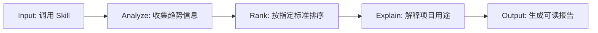

# Proposal: TrendFollower

## Turning GitHub Trend Discovery into a Reusable Codex Skill

## 1. 为什么我选择这个选题

这个项目一开始并不是想做一个很大的工具，而是来自我自己平时反复遇到的一个小问题。

现在 GitHub 上几乎每周都会出现新的 AI 工具、coding agent、workflow framework 或 developer utility。很多项目几天内就会涨很多 stars，也很快被搬运到 X、YouTube、小红书、博客或 newsletter 里，变成“本周最值得关注的 AI 工具”“最近爆火的开源项目”这类内容。

一开始我也会觉得很有意思，因为这些项目确实能反映开发者社区正在关注什么。但看多之后，我发现自己真正花时间的地方并不是“找不到项目”，而是“每一个项目都要重新判断值不值得看”。

很多时候流程都是类似的：先看到一个推荐，再点进 GitHub repo，看 README、stars、demo、安装方式，必要时再让 AI 总结一轮。最后才发现，这个项目可能跟我当下要做的事情关系不大。

所以我想优化的不是某一次项目推荐，而是这个反复出现的筛选过程。

这也是 TrendFollower 的起点：把“发现和初筛 GitHub 趋势项目”这件事，从零散的信息消费，整理成一个可以重复调用的 Codex skill。

## 2. 我看到的问题

GitHub Trending、X 上的推荐、各种工具榜单，本质上都能告诉我“最近大家在看什么”。但它们不一定能直接回答一个更实际的问题：

> 这些项目里，哪些值得我继续看？

对我来说，真正的成本主要有三层。

第一是时间成本。每个 repo 都要点进去看说明、demo、更新情况和使用方式。

第二是注意力成本。项目看多之后，很容易在一堆相似工具里来回切换，最后反而忘了自己原本想找什么。

第三是 token 成本。如果每个项目都丢给 AI 总结一轮，单次不明显，但每周重复下来其实也不少。

所以我看到的核心问题不是“推荐不够多”，而是推荐太多之后，缺少一个低成本的第一轮筛选入口。

TrendFollower 想先解决的就是这个入口问题：先把过去一周增长较快的项目整理出来，用简单的话说明它们是做什么的，再让我决定哪些值得继续打开研究。

## 3. 我的核心洞察：趋势发现是一个重复 workflow

后来我意识到，追踪 GitHub 和 AI 开源项目的趋势，并不是偶尔才会发生的一次性需求。

如果一个人本来就关注 AI 编程、agent workflow、开源工具或自动化项目，那他可能每周都会想知道：最近又出现了什么项目？哪些工具涨得快？有没有什么方向值得学习或测试？

也就是说，“发现趋势”本身就是一个会反复发生的小 workflow。

这也是我为什么不太想只写一个 prompt。单次问 AI “帮我找最近增长最快的 GitHub 项目”当然可以，但每次重新问，AI 都要重新理解我想要什么，也更容易漏来源、混排序，或者输出一些没办法复查的信息。

Skill 的价值就在这里。它不是把一句 prompt 存起来，而是把相对固定的步骤沉淀下来，让 AI 每次都按照比较稳定的方式去找、筛、排、解释。

所以 TrendFollower 的重点不只是“帮我找十个热门项目”，而是把一个原本零散、重复、容易浪费时间的动作，变成一个可以反复使用的 AI workflow。

## 4. 我的解决思路：把 GitHub 趋势发现变成一个可调用的 Skill

确定方向之后，我先想的是：如果要把这件事做成一个可以反复用的 workflow，它每次到底应该做什么？

我最后把它拆成几个固定步骤：



这个拆法的好处是，任务边界比较清楚。

TrendFollower 不需要替我判断哪个项目一定最好，也不需要做成一个完整搜索引擎。它只需要先完成第一轮筛选：找到趋势来源，按增长方式排序，再把项目用途讲清楚。

在信息来源上，我主要考虑两类：一类是 GitHub Trending，另一类是整理 GitHub star growth 和开源项目趋势的网站。前者适合看当前被广泛关注的项目，后者更适合从增长速度判断哪些项目正在快速上升。

输出上，我比较在意可复查性。因为不同来源的数据口径不一样，所以报告里需要尽量标明来源、排序方式和当前限制，而不是只给一个看起来很确定的榜单。

## 5. 我的项目入手方向和 AI 辅助流程

正式做之前，我没有直接让 Codex 写代码，而是先做了一轮比较轻的选题确认。

我先用 Grok 和 Gemini 看了一下现在大家一般从哪里发现 GitHub trend、AI coding tools 和开源项目增长，先建立一个大概的信息地图。

然后我把这些零散信息交给 GPT 做结构化。这个阶段主要是把问题拆清楚：这个需求是不是真实存在、卡点在哪里、输出需要包含什么、数据来源可能有哪些限制。

到这一步，项目边界才比较明确。最后我再把目标、边界和大概流程交给 Codex，让它生成 plan，然后一步步实现 skill、补文档、处理测试和验证。

这次对我来说比较重要的一点是：AI 编程不是一句话让模型直接生成项目。更实际的方式是，人先把问题拆清楚，再让不同工具做适合它的部分。Grok / Gemini 帮我看外部信息，GPT 帮我整理结构，Codex 负责进入代码和文档落地。

## 6. 当前版本：TrendFollower 现在可以做什么

当前版本的 TrendFollower 已经可以通过 slash-style 的方式调用：

```txt
/trendfollower
/trendfollower 1
/trendfollower 2
/trendfollower 1 agent
/trendfollower 2 20 coding tools
```

其中，`1` 表示按照过去一周新增 stars 数量排序，适合看“这周哪些项目最火”。`2` 表示按照 7 天百分比增长排序，更适合发现一些体量不一定大、但最近增长很快的新项目。

后面也可以加入 topic 或 keyword。比如 `/trendfollower 1 agent` 可以看和 agent 相关的项目，`/trendfollower 2 20 coding tools` 可以看和 coding tools 相关、并按百分比增长排序的项目。

输出结果会尽量包含 repo 名称、GitHub 链接、近一周增长数据、项目用途说明、topic 范围、数据来源和当前限制。

我希望它保持一个比较明确的定位：它不是常驻后台的自动规则，而是一个需要时主动调用的小工具。对这个项目来说，可控性比自动化更重要。

## 7. 未来可以怎么改进

我不太想把 TrendFollower 做成一个什么都能做的大工具。它本来就是一个很小、很明确的 skill：当我想快速知道 GitHub 上最近有哪些项目在变热时，它先帮我扫一遍、整理一遍。

所以未来更值得改的，不是继续堆功能，而是让原本的 workflow 更稳定。

目前最大的问题是运行时间。因为当前版本没有后端缓存，也没有提前维护 keyword 字典，所以当 topic 比较宽时，它还是需要一轮一轮抓 GitHub repo、README 和公开来源，再判断项目是否相关。

现在我给它设的是 soft limit 大约 3 分钟、hard limit 大约 5 分钟。对于一个 lightweight skill 来说，这个时间还是偏长。

后面可以考虑做两件事：一是维护一个轻量的 keyword / category 字典，把常见方向先整理出来；二是为常见趋势来源做简单缓存，减少每次都从零开始搜索和判断的成本。

## 8. 总结：这个项目想解决什么

TrendFollower 想解决的不是“再推荐几个 GitHub 项目”这么简单。

网上已经有很多人在推荐工具、整理项目、分享 repo。我真正想解决的是：当 AI 和开源项目更新得越来越快时，能不能先用一个更省时间、更清楚、更低成本的方式，判断哪些东西值得继续看。

对我来说，这个项目的重点不是它功能有多复杂，而是它把一个真实但零散的需求，从观察、调研、拆解，到最后变成了一个可以执行的 AI workflow。

它不会给出一个完美榜单，也不会替我做最终判断。但它可以先把混乱的信息整理成一个清楚入口，让我知道哪些项目正在增长、它们大概是做什么的、哪些值得进一步打开研究。

这也是我从这个项目里得到的主要收获：好的 AI workflow 不一定是生成更多内容，而是帮我减少不必要的筛选，把重复动作变得更稳定。
