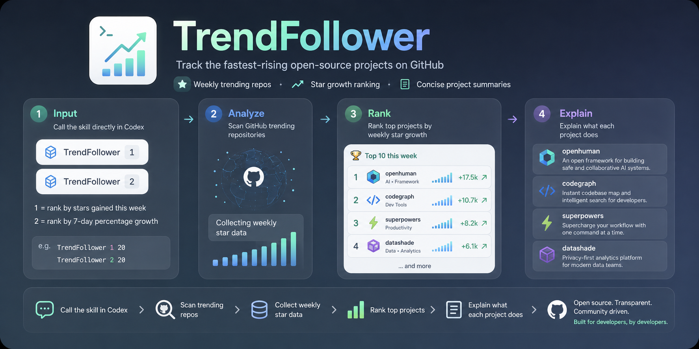

<p align="center">
  
</p>

# TrendFollower

TrendFollower 是一个 Codex skill，用来快速发现过去一周 GitHub 上增长较快的开源项目，并用简洁语言说明它们是做什么的。

我做它的原因很简单：现在 AI 工具和开源项目更新太快，真正耗时间的往往不是“有没有项目可以看”，而是“哪些项目值得继续看”。TrendFollower 把这件反复发生的小事整理成一个可以调用的 AI workflow，让用户先看到 overview，再决定要不要继续研究。

## 它可以做什么

在 Codex 中直接输入：

```text
/trendfollower
/trendfollower 1
/trendfollower 2
/trendfollower 1 agent
/trendfollower 2 20 coding tools
```

模式说明：

- `1`：默认模式，按过去一周新增 stars 排序。
- `2`：按 7 天百分比增长排序，适合发现最近增长很快的新项目。
- mode 后面的数字表示输出数量，例如 `/trendfollower 1 20`。
- 后面的文字表示 topic / keyword，例如 `agent`、`coding tools`、`3D`。

输出会尽量包含：

- repo 名称和链接；
- 近一周增长数据；
- 项目用途说明；
- topic / scope；
- 数据来源和当前限制。

## 安装方式

克隆这个 repository，然后把 skill 复制到 Codex 的 skills 目录：

```bash
git clone https://github.com/ycl-2004/Trend-Follower.git
mkdir -p ~/.codex/skills
cp -R Trend-Follower/skills/trend-follower ~/.codex/skills/
```

安装后重启 Codex，让 Codex 重新发现这个 skill。

## 使用方式

基础调用：

```text
/trendfollower
```

指定模式、数量和 topic：

```text
/trendfollower 2 20 coding tools
```

TrendFollower 会在聊天中直接返回结果。如果当前环境允许写入文件，它也会把完整 Markdown 报告写到：

```text
~/Documents/Codex/TrendFollower/trend-follower.md
```

如果只能写入当前 workspace，则使用 fallback 路径：

```text
outputs/trend-follower.md
```

报告文件默认覆盖旧版本，方便保持固定输出路径。

## 运行速度和限制

TrendFollower 是快速发现工具，不是完整研究任务。默认目标是在 3 分钟左右完成，并在接近 5 分钟时停止扩大搜索范围。

如果 topic 很宽，或者数据源没有现成的 topic 周增长榜，它可能需要逐个检查 repo、README 和公开来源，所以运行时间会变长。

需要注意的是，不同趋势网站对 weekly growth 的统计口径可能不同。TrendFollower 会尽量标明数据来源和排序方式，不把结果包装成绝对完整的榜单。

下一步可以考虑加入轻量 keyword / category 字典，或者缓存常见趋势来源，让 topic 搜索更快、更稳定。

## 关于 slash-style 调用

当前 `/trendfollower` 是通过 skill description 识别的 slash-style prompt，不一定会出现在 Codex 的 slash command 菜单里。

即使没有菜单项，直接在聊天中输入 `/trendfollower`、`/trendfollower 1`、`/trendfollower 2` 或带 topic 的调用方式，也可以触发这个 workflow。

## 依赖

正常使用需要：

- 支持 skill discovery 的 Codex 环境；
- 可以联网搜索公开 GitHub 趋势数据；
- 如果需要保存报告，需要有文件写入权限。

GitHub connector/plugin 不是必需项。Python 也是可选的，`scripts/render_report.py` 只用于在已有结构化数据时稳定生成 Markdown 报告。

## 项目结构

```text
skills/
  trend-follower/
    SKILL.md
    agents/openai.yaml
    references/source-policy.md
    references/output-format.md
    scripts/render_report.py
```

## 开发和验证

检查 skill 文件结构：

```bash
python3 ~/.codex/skills/.system/skill-creator/scripts/quick_validate.py skills/trend-follower
```

测试报告 formatter：

```bash
printf '[{"repo":"owner/repo","url":"https://github.com/owner/repo","growth":"+100 stars","purpose":"Example project.","source":"Fixture","source_url":"https://example.com"}]' | python3 skills/trend-follower/scripts/render_report.py --mode 1 --sources "Fixture" --limitations "Fixture data for local testing only."
```

测试 topic 报告 formatter：

```bash
printf '[{"repo":"owner/repo","url":"https://github.com/owner/repo","growth":"+100 stars","purpose":"Example project.","source":"Fixture","source_url":"https://example.com"}]' | python3 skills/trend-follower/scripts/render_report.py --mode 1 --topic "agent" --scope "GitHub repository search candidate set, ranked by weekly star gain" --sources "Fixture" --limitations "Fixture data for local testing only." --output /tmp/trend-follower-topic.md
```
